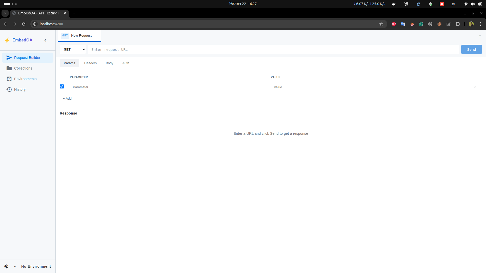

# EmbedQA - API Testing Platform

A modern, Postman-like API testing platform built with Angular 17 and Spring Boot.


## 🚀 Features

### Current

- ✅ **Multi-Tab Interface** - Work on multiple requests simultaneously
- ✅ **Request Builder** - Full-featured HTTP request configuration
  - URL bar with method selector (GET, POST, PUT, DELETE, PATCH, HEAD, OPTIONS)
  - Query parameters editor
  - Headers editor
  - Request body (JSON, XML, Form Data, Raw)
  - Authentication (Bearer Token, Basic Auth, API Key)
- ✅ **Response Viewer** - View response body, headers, status, timing
- ✅ **Environment Support** - Switch between environments (Dev, Staging, Prod)
- ✅ **Dark Theme** - Modern dark UI design
- ✅ **Collapsible Sidebar** - Maximize workspace

### Upcoming

- 🔜 Collections management
- 🔜 Request history
- 🔜 Environment variables editor
- 🔜 Import/Export (Postman format)
- 🔜 Monaco Editor integration

## 📸 Screenshots



## 🛠️ Tech Stack

### Frontend
| Technology | Version | Purpose |
|------------|---------|---------|
| Angular | 17.x | Framework |
| TypeScript | 5.4 | Language |
| RxJS | 7.8 | Reactive programming |
| Angular Signals | - | State management |
| SCSS | - | Styling |

### Backend
| Technology | Version | Purpose |
|------------|---------|---------|
| Spring Boot | 3.5.7 | Framework |
| Java | 21 | Language |
| PostgreSQL | 16 | Database |
| Apache HttpClient 5 | 5.3 | HTTP requests |

## 📁 Project Structure

```
src/app/
├── core/                          # Core functionality
│   ├── enums/
│   │   ├── HttpMethod.ts          # GET, POST, PUT, DELETE, etc.
│   │   ├── BodyType.ts            # JSON, XML, FORM_DATA, RAW
│   │   └── AuthType.ts            # NONE, BEARER_TOKEN, BASIC_AUTH, API_KEY
│   ├── models/
│   │   ├── ExecuteRequest.ts      # Request payload model
│   │   ├── ApiResponse.ts         # Response model
│   │   ├── RequestTab.ts          # Tab state model
│   │   ├── Environment.ts         # Environment model
│   │   ├── Collection.ts          # Collection model
│   │   └── ...
│   ├── services/
│   │   ├── state.service.ts       # Signal-based state management
│   │   ├── api-executor.service.ts # Execute HTTP requests
│   │   ├── collection.service.ts  # Collections CRUD
│   │   ├── environment.service.ts # Environments CRUD
│   │   └── request.service.ts     # Saved requests CRUD
│   └── interceptors/
│       └── http-error.interceptor.ts
├── shared/                        # Shared components
│   └── components/
│       └── key-value-editor/      # Reusable key-value editor
├── features/                      # Feature modules
│   ├── request-builder/           # Main request builder
│   ├── collections/               # Collections management (placeholder)
│   ├── environments/              # Environments management (placeholder)
│   └── history/                   # Request history (placeholder)
├── app.component.ts               # Root component with sidebar
├── app.config.ts                  # Application configuration
└── app.routes.ts                  # Routing configuration
```

## 🚦 Getting Started

### Prerequisites

- Node.js 18+
- npm 9+
- Angular CLI 17 (`npm install -g @angular/cli`)

### Installation

```bash
# Clone the repository
git clone https://github.com/AkashBhuiyan/embedqa-ui.git
cd embedqa-ui

# Install dependencies
npm install

# Start development server
npm start
```

The app will be available at `http://localhost:4200`

### Backend Setup

The frontend expects the backend API at `http://localhost:8085/api/v1`. See the [backend repository](https://github.com/AkashBhuiyan/embedqa) for setup instructions.

## 🔧 Configuration

### Proxy Configuration

API requests are proxied to the backend via `proxy.conf.json`:

```json
{
  "/api": {
    "target": "http://localhost:8085",
    "secure": false,
    "changeOrigin": true
  }
}
```

### Environment Files

```typescript
// src/environments/environment.ts (Development)
export const environment = {
  production: false,
  apiUrl: '/api/v1'
};

// src/environments/environment.prod.ts (Production)
export const environment = {
  production: true,
  apiUrl: '/api/v1'
};
```

## 📖 Usage Guide

### Creating a Request

1. Click the **+** button in the tab bar to create a new tab
2. Select the HTTP method from the dropdown
3. Enter the request URL
4. Configure parameters, headers, body, or authentication as needed
5. Click **Send**

### Using Query Parameters

1. Click the **Params** tab
2. Add key-value pairs
3. Toggle the checkbox to enable/disable individual parameters
4. Parameters are automatically appended to the URL

### Setting Headers

1. Click the **Headers** tab
2. Add header name-value pairs
3. Common headers like `Content-Type` are auto-set based on body type

### Request Body

1. Click the **Body** tab
2. Select body type: JSON, XML, Form Data, or Raw
3. Enter the body content in the text area

### Authentication

1. Click the **Auth** tab
2. Select auth type:
   - **Bearer Token**: Enter your JWT or access token
   - **Basic Auth**: Enter username and password
   - **API Key**: Enter key and header name (default: X-API-Key)

### Environment Switching

1. Click the environment dropdown in the header
2. Select an environment (Dev, Staging, Prod)
3. Environment variables like `{{baseUrl}}` will be substituted

## 🎨 Theming

The app uses CSS custom properties for theming. Variables are defined in `src/styles.scss`:

```scss
:root {
  --bg-primary: #1e1e1e;
  --bg-secondary: #252526;
  --bg-tertiary: #2d2d2d;
  --text-primary: #e0e0e0;
  --text-secondary: #a0a0a0;
  --accent-primary: #4fc3f7;
  --status-success: #98c379;
  --status-danger: #e06c75;
  // ...
}
```

## 🧪 Development

### Available Scripts

```bash
# Start development server
npm start

# Build for production
npm run build

# Run tests
npm test

# Lint code
npm run lint
```

### Code Style

- Use Angular standalone components
- Use signals for state management
- Use `@core/`, `@shared/`, `@features/`, `@env/` path aliases
- Follow Angular style guide

## 🤝 Contributing

1. Fork the repository
2. Create a feature branch (`git checkout -b feature/amazing-feature`)
3. Commit your changes (`git commit -m 'Add amazing feature'`)
4. Push to the branch (`git push origin feature/amazing-feature`)
5. Open a Pull Request

## 🙏 Acknowledgments

- Inspired by [Postman](https://www.postman.com/)
- Built with [Angular](https://angular.io/)
- Icons from [Lucide](https://lucide.dev/)
